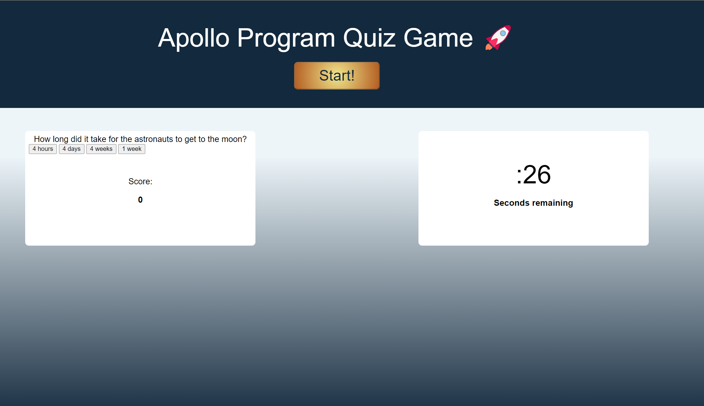

# Kit Williams
# Quiz Game

Create an application that enables users to play a quiz game, and store their score in local storage

## Acceptance Criteria

AS A coding boot camp student
I WANT to take a timed quiz that stores high scores
SO THAT I can gauge my progress compared to my peers

GIVEN I am taking a quiz
WHEN I click the start button
THEN a timer starts and I am presented with a question
WHEN I answer a question
THEN I am presented with another question
WHEN I answer a question incorrectly
THEN time is subtracted from the clock
WHEN all questions are answered or the timer reaches 0
THEN the game is over
WHEN the game is over
THEN I can save my initials and my score
# Screenshot

Repo: https://github.com/kitanablade/quiz-timer
Site: https://kitanablade.github.io/quiz-timer/